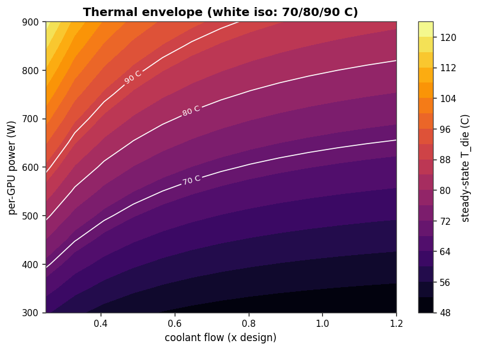

# ThermaLoop

**An open, physics-informed simulation lab for direct-to-chip liquid cooling in AI data centers.**

ThermaLoop models the full path heat takes — from an LLM-inference workload,
through the GPU package and cold plate, around the coolant loop, across the CDU,
and out to facility water — as a transparent, modular system you can run,
perturb, and learn from in seconds. It is deliberately *not* a CFD replacement,
an enterprise digital twin, or a commercial tool. It is a teaching-grade
engineering sandbox for understanding how liquid-cooled AI infrastructure
behaves under real workloads, faults, and design tradeoffs — with every
assumption written down and every steady-state number traceable to a published
anchor.

Here "physics-informed" means physics-based modeling (conservation laws, ε-NTU,
affinity-law pumps), stated plainly — not a machine-learning method claim.



*Steady-state die temperature across the power × flow plane (70/80/90 °C
iso-lines). More output in the [gallery](docs/gallery.md).*

**▶ Try it live:** [interactive cooling explorer](docs/explorer.html) — drag
GPU power, coolant flow, facility temperature, and coolant type and watch die
temperature, margin, pump energy, and the operating point move in real time;
trigger a pump failure and watch it race toward throttle. Runs entirely in the
browser on the *same* validated physics (die temp matches the Python model to
0.000 °C, enforced by a test). Enable GitHub Pages on `/docs` to host it.

## What it does

- Simulates an 8-GPU H100-class server cooling loop end to end.
- Lumped 5-node RC thermal model **and** a 1-D finite-volume loop that resolves
  the spatial gradient between cold-plate exit and CDU exit.
- ε-NTU CDU calibrated to a published experimental anchor.
- Affinity-law pump model so flow has a real energy cost.
- Safety margins and time-to-throttle under transients.
- Runs with **no external data** (synthetic workload by default); optionally
  driven by real Azure LLM inference traces.

## What it does **not** do

- No CFD, 3-D fields, meshing, or chip-level hot spots — use Ansys/Cadence.
- No two-phase or immersion cooling.
- No enterprise digital twin, telemetry, or BMS integration.
- No RL or learned control. (A DeepONet surrogate lives under `experimental/`,
  clearly labeled and unsupported.)
- No multi-rack or facility-scale topology.

See [`docs/ASSUMPTIONS.md`](docs/ASSUMPTIONS.md) for the full list of
simplifications and [`docs/decisions/000-charter.md`](docs/decisions/000-charter.md)
for the scope charter.

## Quick start

```bash
pip install -e .

# Run the nominal server and write a self-contained HTML engineering report
thermaloop run configs/baseline.yaml

# Run a fault scenario (5 included)
thermaloop run configs/faults/pump_degradation.yaml

# Run an optimization sweep (pump speed / flow vs margin / CDU setpoint)
thermaloop sweep configs/sweeps/flow_vs_margin.yaml

# Generate the reference design-space maps (envelope, 1-D loop, heat-path Sankey)
thermaloop envelope

pytest -q          # 35 tests: physics invariants, anchor validation, scenarios
```

Each command writes a portable HTML report to `reports/<name>/report.html` with
the plots embedded — one file you can open or share, no external assets.

### Scenarios included

Faults (`configs/faults/`): workload spike, pump degradation, CDU fouling, warm
facility water, coolant-loss approximation. Each reports peak die temperature,
minimum margin, time-to-throttle, and pump energy.

Sweeps (`configs/sweeps/`): pump speed vs die temperature, flow vs thermal
margin (Pareto front), CDU setpoint vs energy.

Real workloads & coolants: `configs/azure_conv.yaml` and `azure_code.yaml` drive
the server with real Microsoft Azure LLM inference traces (CC-BY, shipped in
`data/`). `configs/pg_coolant.yaml` swaps water for a 25% propylene-glycol/water
mixture via the temperature-dependent fluid model — lower specific heat and
higher viscosity, so the die runs hotter.

Scenarios are plain YAML — define a workload, a coolant fluid, static overrides,
and a perturbation timeline (step/ramp on flow, CDU conductance, facility
temperature, or power). No code needed to add a new one.

## Validation

Reference scenario: one 8-GPU server, 700 W/GPU sustained, 30 °C facility
supply, design flow.

| Quantity                | ThermaLoop | Anchor                      |
|-------------------------|-----------:|-----------------------------|
| CDU effectiveness       | 0.822      | 0.82–0.83 (Khalili 2024)    |
| T_die at TDP            | 74.1 °C    | 70–85 °C, H100-class        |
| Loop ΔT above facility  | 6.8 K      | 5–10 K, warm-water D2C      |
| Heat-balance closure    | 100 %      | conservation                |

These numbers are regenerated from the model and enforced by the test suite on
every push. See [`docs/VALIDATION.md`](docs/VALIDATION.md).

## Repository layout

```
thermaloop/
  workload/   synthetic generator + Azure trace loader
  power/      GPU 3-state power model
  thermal/    rc_network.py (lumped 5-node), loop_1d.py (1-D loop)
  cdu/        ε-NTU heat exchanger
  hydraulics/ affinity-law pump
  safety.py   margin + time-to-throttle
  fluids.py   temperature-dependent coolant properties (water / PG-water)
  scenarios/  engine.py (YAML perturbation timeline), sweeps.py
  viz/        plots.py, report.py (HTML), style.py
  system.py   composes the full server simulation
  __main__.py CLI: run / sweep / envelope
configs/      baseline + faults/ + sweeps/ + azure + pg_coolant  (YAML)
examples/     run_azure.py (real-trace driver)
experimental/ DeepONet surrogate (unsupported; see its README)
data/         Azure LLM inference traces (CC-BY)
docs/         ASSUMPTIONS, VALIDATION, gallery, decision records (ADRs 000-003)
tests/        35 tests: physics invariants, anchor validation, scenarios, fluids
```

## Roadmap

Done in v0.2: scenario engine; five fault scenarios; three optimization sweeps;
temperature-dependent, selectable fluid model (water / PG-water); real
Azure-trace scenarios; self-contained HTML reports; the plot suite (transient,
safety-margin timeline, Pareto, thermal envelope, 1-D loop field, heat-path
Sankey); and a committed [gallery](docs/gallery.md).

Next:
- Multi-rack / shared-CDU topology (currently single server) — a deliberate
  scope decision, not a default
- Per-timestep fluid-property variation (currently constant within a run)
- (Experimental) operator-learning surrogate with a Fourier-neural-operator trunk

## Author

**Travis Walla** — Consulting engineer, San Antonio / New Braunfels, Texas
GitHub: [@Walla17x](https://github.com/Walla17x)

## License

MIT for code and documentation. Azure trace data under `data/` is CC-BY per its
original distribution; see [`data/README.md`](data/README.md).
