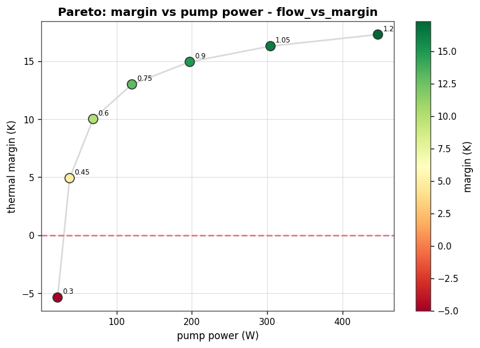
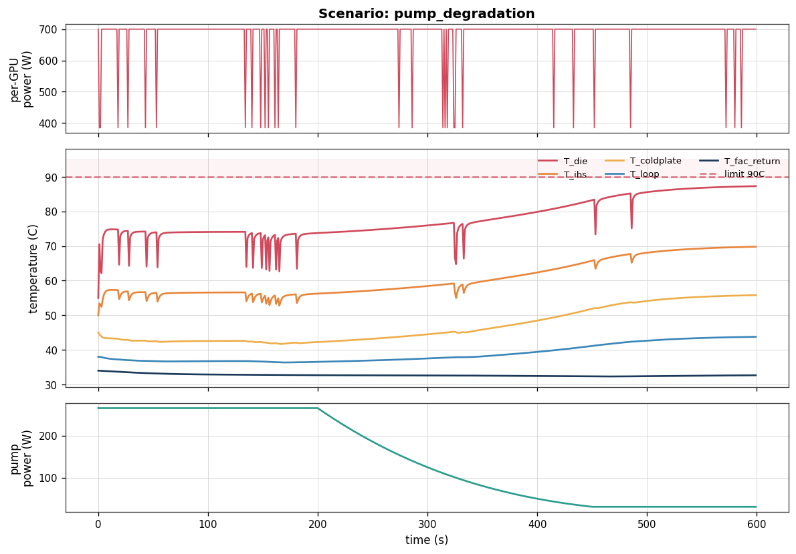
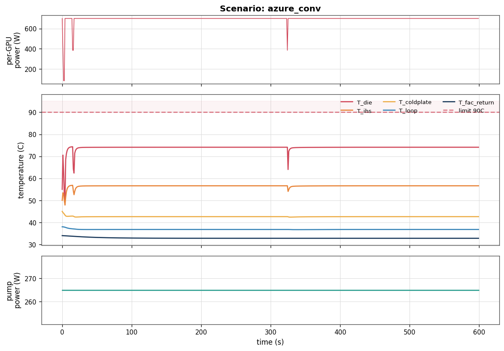
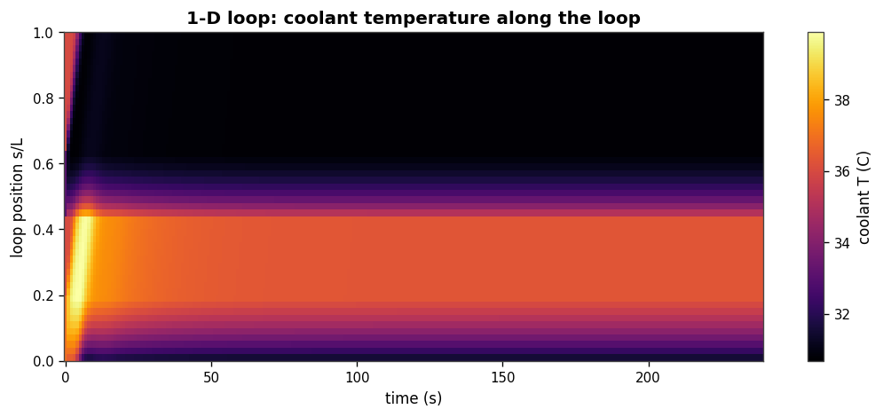
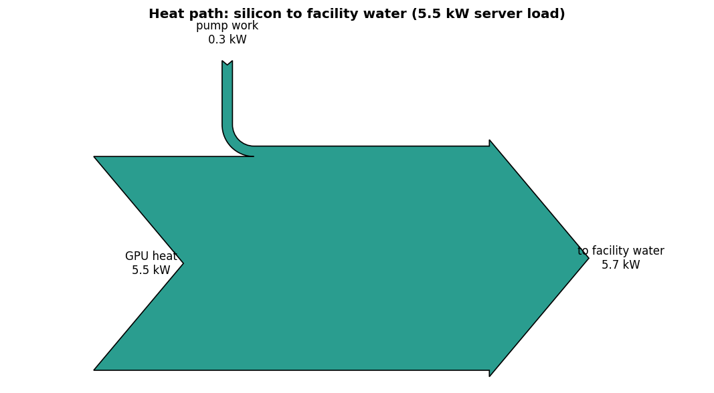

# Gallery

Representative output from ThermaLoop. Every image is generated by the CLI or a
config in this repo; nothing here is hand-drawn.

## Thermal envelope

Steady-state die temperature across the per-GPU power and coolant-flow plane,
with 70/80/90 C iso-lines. The operating map for the reference server.

`thermaloop envelope`

## Flow vs thermal margin (Pareto)

The core tradeoff: pump power grows with the cube of flow while thermal margin
saturates. The knee is around 0.6-0.75x design flow.

`thermaloop sweep configs/sweeps/flow_vs_margin.yaml`

## Fault: pump degradation

Coolant flow ramps to 40% from t=200 s. Pump power drops cubically while die
temperature climbs toward the limit — the energy-vs-safety tradeoff as a transient.

`thermaloop run configs/faults/pump_degradation.yaml`

## Real Azure inference trace

The reference server driven by a real Microsoft Azure LLM inference
conversation trace (CC-BY), not a synthetic workload.

`thermaloop run configs/azure_conv.yaml`

## 1-D loop temperature field

Coolant temperature along the loop over time; hottest at cold-plate exit,
coolest after the CDU.

## Heat path

Server heat plus pump work, rejected to facility water.

